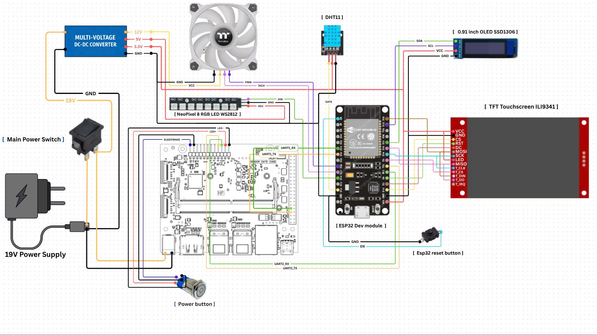
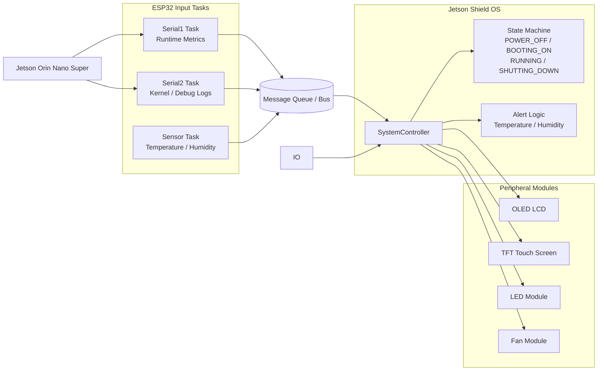

# Jetson Shield OS

## Project Introduction

Jetson Shield OS is a transparent enclosure project for the Jetson Orin Nano Super. An ESP32 acts as a companion controller connected to the Jetson through two serial ports: one channel carries runtime parameters, and the second channel captures kernel and debugging messages. The ESP32 then presents system status, alerts, and boot or shutdown activity across local displays, lighting, and cooling hardware.

## Hardware

- Jetson Orin Nano Super
- ESP32
- Transparent case / shield enclosure
- PWM fan
- LEDs
- OLED LCD
- TFT touch screen
- Sensors
- Buttons
- Switches

## Hardware Diagram

<p align="center">
  
</p>

## Software Diagram



Additional assembly and design image galleries are collected in [docs/README.md](docs/README.md).

## Demo Images

<p align="center">
	
	
</p>

<p align="center">
	
	
</p>

<p align="center">
	
	
</p>

## Video

[](https://youtu.be/KmZ7pbCNbDI)

Watch the short demo here: https://youtu.be/KmZ7pbCNbDI

## Setup Guide

### 1. Create the Jetson service

The `system_monitor.c` program reads Jetson stats from `tegrastats` and sends a compact status line to the ESP32 over UART.

Build it on Jetson:

```bash
gcc -O2 -s -o system_monitor system_monitor.c
```

Copy the binary and service file into place:

```bash
sudo cp system_monitor /usr/local/bin/system_monitor
sudo cp system_monitor.service /etc/systemd/system/system_monitor.service
sudo systemctl daemon-reload
sudo systemctl enable --now system_monitor.service
```

Check that it is running:

```bash
sudo systemctl status system_monitor.service
sudo journalctl -u system_monitor.service -f
```

If your Jetson UART device is different, update the `ExecStart` line in `system_monitor.service` before enabling the service.

### 2. Upload the ESP32 code

The ESP32 firmware is inside the `Jetson_case_os/` folder.

1. Copy the whole `Jetson_case_os/` folder into your Arduino sketches directory.
2. Open `Jetson_case_os.ino` in Arduino IDE.
3. Select the correct ESP32 board and port.
4. Click Upload.

After uploading, connect the ESP32 to the Jetson and start the `system_monitor` service so the two sides can exchange data.